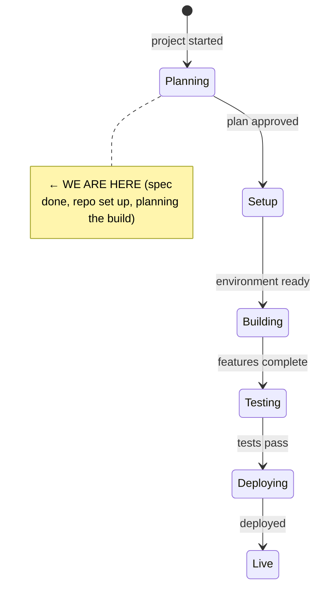
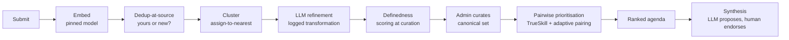

# State

> Last updated: 2026-06-01

## System State Diagram

## Component Status

| Component | Status | Notes |
|-----------|--------|-------|
| Spec | ✅ Done | `question-bank-spec.md` v0.1, local-first stack finalised |
| Repo + Claude template | ✅ Done | Pushed to `dataforaction-tom/open-question-bank` (public) |
| Open decisions (§15) | ⏳ Not started | Licence, judging auth, embedding model, rubric wording |
| Embedding bake-off | ⏳ Not started | Fixes pgvector dimensionality — gates first migration |
| Next.js app + docker compose | ⏳ Not started | Ollama + Postgres/pgvector + app |
| DB schema + migrations | ⏳ Not started | Append-only transformation tables, dataset-version aware |
| Submit + Embed + Dedup | ⏳ Not started | Pipeline slice 1 |
| Cluster + moderation gate | ⏳ Not started | Slice 2 |
| LLM refinement (training set) | ⏳ Not started | Slice 3 — the defensible core |
| Definedness scoring + curation | ⏳ Not started | Slice 4 |
| Campaigns + TrueSkill comparison | ⏳ Not started | Slice 5 |
| Ranked agenda + evidence views | ⏳ Not started | Slice 6 |
| Synthesis (propose/endorse) | ⏳ Not started | Slice 7 |
| Open data export + anonymisation | ⏳ Not started | CC0/ODbL TBD; GDPR withdrawal tombstones |
| Cold-start seeds + import | ⏳ Not started | CSV/JSON |

Markers: ⏳ Not started · 🔧 In progress · ✅ Done · 🚫 Blocked · ⚠️ Needs attention

## Data Flow (the pipeline spine)

## Dependencies

| Dependency | Status | Notes |
|------------|--------|-------|
| Ollama (embedding + reasoning LLM) | Not set up | Local server; embedding model pinned per dataset version |
| Postgres + pgvector | Not set up | Single store, relational + vectors; column width set by embedding dim |
| OpenRouter (optional) | Not set up | Remote reasoning for synthesis only; reintroduces per-call cost |
| Docker / docker compose | Available locally | Orchestrates the single-machine stack |

<!--
Keep this file as the single source of truth for "where are we?"
The /status command reads this file.
-->
