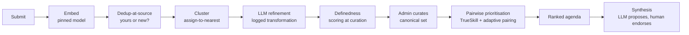

# State

> Last updated: 2026-06-10

## System State Diagram

```mermaid
stateDiagram-v2
    [*] --> Planning: project started
    Planning --> Setup: plan approved
    Setup --> Building: environment ready
    Building --> Testing: features complete
    Testing --> Deploying: tests pass
    Deploying --> Live: deployed

    note right of Building: ← WE ARE HERE (Slices 1-4 built + tested; Slices 5-7 next)
```

## Component Status

| Component | Status | Notes |
|-----------|--------|-------|
| Spec | ✅ Done | `question-bank-spec.md` v0.1, local-first stack finalised |
| Repo + Claude template | ✅ Done | Pushed to `dataforaction-tom/open-question-bank` (public) |
| Open decisions (§15) | ✅ Done | CC0 · open+fingerprinted · pin `nomic-embed-text` (768) · rubric in `definedness-rubric.md` |
| Embedding bake-off | ⏳ Not started | `nomic-embed-text` (768) pinned as default; bake-off confirms before final migration |
| Next.js app + docker compose | ✅ Done | Next 15 + Drizzle; `docker compose` runs db (pgvector) + ollama + app, all healthy |
| DB schema + migrations | ✅ Done | `dataset_version` + `question`; `vector(768)` + HNSW cosine; one-active-version partial unique index; drizzle-kit migrations |
| Submit + Embed + Dedup | ✅ Done | Slice 1 — submit→embed(pinned)→dedup-at-source; 13 unit/integration tests + Playwright e2e; endpoint hardened per review |
| Cluster + moderation gate | ✅ Done | Slice 2 — admin auth (signed-cookie), manual moderation queue, assign-to-nearest clustering, append-only `moderation_event` |
| LLM refinement (training set) | ✅ Done | Slice 3 — pluggable provider (local Ollama / Ollama Cloud / OpenRouter), append-only `refinement` log, admin refine UI (suggest → accept/edit/reject) + per-question history; no re-embedding, no state change |
| Definedness scoring + curation | ✅ Done | Slice 4 — append-only `definedness_score` (1–5 + rationale per criterion, advisory), audited `clustered → canonical` promotion, `/admin/curation` UI |
| Campaigns + TrueSkill comparison | ⏳ Not started | Slice 5 |
| Ranked agenda + evidence views | ⏳ Not started | Slice 6 |
| Synthesis (propose/endorse) | ⏳ Not started | Slice 7 |
| Open data export + anonymisation | ⏳ Not started | CC0/ODbL TBD; GDPR withdrawal tombstones |
| Cold-start seeds + import | ⏳ Not started | CSV/JSON |

Markers: ⏳ Not started · 🔧 In progress · ✅ Done · 🚫 Blocked · ⚠️ Needs attention

## Data Flow (the pipeline spine)



## Dependencies

| Dependency | Status | Notes |
|------------|--------|-------|
| Ollama (embedding + reasoning LLM) | ✅ Running | Docker service; `nomic-embed-text` pulled (768-dim), pinned in `dataset_version`. Reasoning default `qwen2.5:7b` is configured but **not pulled** — `ollama pull qwen2.5:7b` needed before the live refine path (tests use a `mock` provider) |
| Postgres + pgvector | ✅ Running | `pgvector/pgvector:pg16` Docker service; `vector` extension enabled; `qb` (dev) + `qb_test` (tests) |
| OpenRouter (optional) | Not set up | Remote reasoning for synthesis only; reintroduces per-call cost |
| Docker / docker compose | Available locally | Orchestrates the single-machine stack |

<!--
Keep this file as the single source of truth for "where are we?"
The /status command reads this file.
-->
